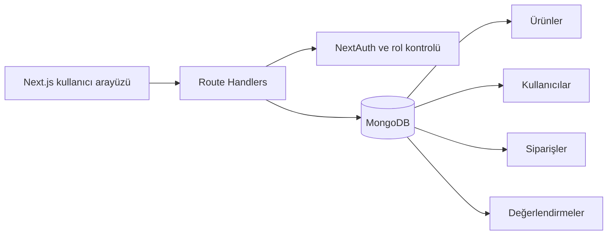

# Cavalyn Natural E-Commerce

Cavalyn için Next.js App Router ve MongoDB ile geliştirilmiş tam kapsamlı doğal kozmetik e-ticaret uygulaması. Müşteri alışveriş deneyimini ürün yönetimi, sipariş takibi ve rol tabanlı yönetici paneliyle tek projede birleştirir.

## Özellikler

- Kategori, arama, fiyat ve sıralama filtreli ürün kataloğu
- Ürün ayrıntıları, değerlendirmeler ve puanlama
- Yerel olarak saklanan sepet ve stok kontrollü sipariş akışı
- Üyelik, oturum açma ve şifreli parola saklama
- Favori ürünler, profil ve sipariş geçmişi
- Ürün, sipariş ve kullanıcı yönetimi için yönetici paneli
- Kullanıcı ve yönetici rotaları için rol tabanlı erişim kontrolü
- Mobil cihazlara uyumlu özgün arayüz
- GitHub Actions ile kod kalitesi ve üretim derlemesi kontrolü

## Teknolojiler

| Alan | Teknoloji |
|---|---|
| Uygulama | Next.js 16, React 19 |
| Veritabanı | MongoDB, Mongoose |
| Kimlik doğrulama | NextAuth, bcryptjs |
| Stil | Modern CSS |
| Kalite | ESLint, GitHub Actions |

## Mimari



## Kurulum

Node.js 22 ve çalışan bir MongoDB bağlantısı gerekir.

```bash
npm install
```

Örnek çevre ayarını kopyalayın ve kendi değerlerinizi girin:

```powershell
Copy-Item .env.example .env.local
```

`NEXTAUTH_SECRET` için uzun ve rastgele bir değer kullanın. Ardından örnek ürünleri oluşturup uygulamayı başlatın:

```bash
npm run seed
npm run dev
```

Uygulama `http://localhost:3000` adresinde açılır.

## Komutlar

```bash
npm run dev
npm run lint
npm run build
npm run seed
npm run create-admin
```

Yönetici oluşturma komutu `ADMIN_NAME`, `ADMIN_EMAIL` ve en az 12 karakterli `ADMIN_PASSWORD` değerlerini çevre ayarlarından okur; bilgiler kaynak koda yazılmaz.

## Proje yapısı

```text
app/          Sayfalar, yönetici alanı ve API rotaları
components/   Paylaşılan arayüz bileşenleri
context/      Sepet ve bildirim durumları
lib/          Veritabanı, kimlik doğrulama ve sabitler
models/       Mongoose veri modelleri
scripts/      Örnek veri ve yönetici oluşturma araçları
public/       Marka ve kategori görselleri
```

## Güvenlik

- Parolalar bcrypt ile özetlenir.
- Yönetici işlemleri oturum ve rol kontrolünden geçer.
- Gizli bağlantı ve anahtarlar `.env.local` içinde tutulur ve Git tarafından yok sayılır.
- Depoda yalnızca güvenli alan adlarını gösteren `.env.example` bulunur.

## Lisans

[MIT](LICENSE)
